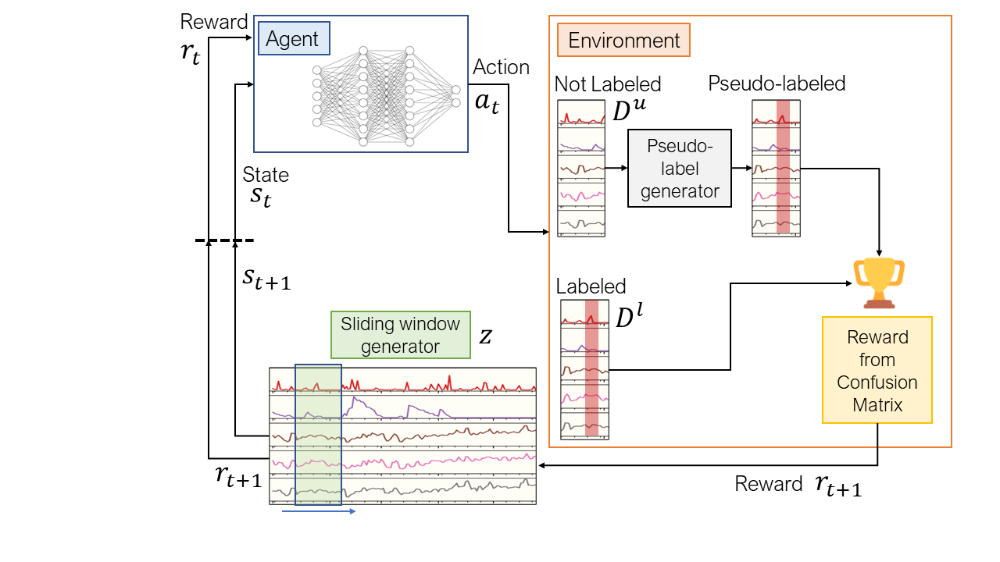

## A Proximal Policy Optimization-based Reinforcement Learning Model for Multivariate Time Series Anomaly Detection

### Abstract
Efficient anomaly detection in multivariate time series data is becoming increasingly important for modern industrial
applications. Anomaly detection in time series data refers to the identification of time points at which time series exhibit abnormal
behavior. However, building a system that can quickly and reliably identify anomalous events is a challenging task. This is due to the
lack of fully labeled time series data and intricate correlation among the channels of the multivariate time series. Even though deep
learning approaches for anomaly detection have recently advanced, only a few of them can effectively address these challenges. In this
paper, we propose a Reinforcement Learning based multivariate Time series Anomaly Detection (RLTAD) framework. RLTAD, in
particular, utilizes the proximal policy optimization (PPO) method to optimize the underlying policy for detecting anomalies. RLTAD is
uniquely designed as a universal model so that it can work on fully labeled data, partially labeled data, and unlabeled data. Extensive
experiments on three publicly available datasets and two synthetic datasets demonstrate that RLTAD can outperform the baseline
methods in terms of precision, recall, and F1 score. In addition, the RLTAD framework’s interpretability is studied by employing the
Gradient Class Activation Map (Grad-CAM).





## Installation
Make sure you have **python 3.8+** installed.
```
git clone https://github.com/abdurrahman1828/rltad-ppo.git
cd rltad-ppo
pip install -r requirments.txt
pip install -e .
```

## Scripts
Train and evaluate RLTAD with `main.py`. \
RL environment is defined in `env.py`. \
Required utility functions are in `utils.py`.

## Dataset sources
SKAB (Publicly available): [https://github.com/waico/SKAB](https://github.com/waico/SKAB) \
SWaT & WADI (Available on request): [https://itrust.sutd.edu.sg/itrust-labs_datasets/dataset_info](https://itrust.sutd.edu.sg/itrust-labs_datasets/dataset_info/)

